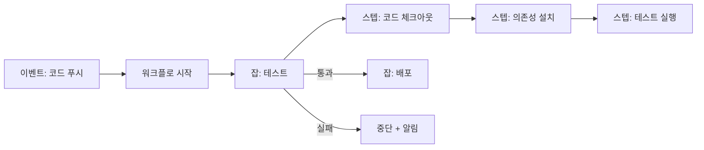
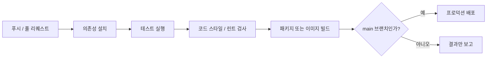

---
title: "GitHub Actions와 CI/CD, 로봇 조립 라인으로 이해하기"
description: "수동 배포가 망친 주말에서 출발해, GitHub Actions로 테스트와 배포를 자동화하는 조립 라인을 만드는 방법을 정리했다. 핵심 개념 다섯 가지와 흔한 함정, AI 활용법까지 다룬다."
date: "2026-07-22"
published_at: "2026-07-25"
category: "news"
tags: []
cover: "https://media2.dev.to/dynamic/image/width=1000,height=420,fit=cover,gravity=auto,format=auto/https%3A%2F%2Fdev-to-uploads.s3.us-east-2.amazonaws.com%2Fuploads%2Farticles%2F4rmzy1vumyl7vaz0rmo8.png"
coverAlt: "GitHub Actions & CI/CD, Explained Like a Robot Assembly Line"
slug: "github-actions-cicd-robot-assembly-line"
source_id: "devto-4205702"
source_url: "https://dev.to/ramkumar-m-n/github-actions-cicd-explained-like-a-robot-assembly-line-1f7c"
source_title: "GitHub Actions & CI/CD, Explained Like a Robot Assembly Line"
source_author: "Ramkumar M N"
source_published: "2026-07-22"
---

<LinkCard url="https://dev.to/ramkumar-m-n/github-actions-cicd-explained-like-a-robot-assembly-line-1f7c" author="Ramkumar M N" date="2026-07-22" />

## 개요

원문 필자는 두 번 다시 겪고 싶지 않은 습관 하나를 이야기한다. 손으로 하던 배포다. 누군가 서버에 최신 코드를 직접 내려받고, 기억에 의존해 명령어 몇 개를 치고, 잘 되기를 바랐다. 어느 금요일, 동료가 한 단계를 빠뜨렸다. 잘못된 설정이 그대로 배포됐고 테스트도 돌리지 않은 채였다. 결국 토요일 내내 그 문제를 풀며 주말을 날렸다.

필자가 얻은 교훈은 "더 조심하자"가 아니었다. 사람은 원래 단계를 빠뜨린다. 진짜 교훈은 이거였다. **테스트와 배포처럼 반복적이고 실수하기 쉬운 일은 로봇이, 매번 똑같은 방식으로 처리하게 만들어야 한다.** 그 로봇이 바로 CI/CD이고, GitHub Actions는 이 로봇을 만드는 가장 널리 쓰이는 방법 중 하나다.

## CI/CD란 무엇인가

무섭게 생긴 알파벳 뒤에는 단순한 생각 두 개가 숨어 있다.

- **CI (Continuous Integration, 지속적 통합):** 누군가 코드를 바꿀 때마다 자동으로 빌드하고 테스트를 돌린다. 몇 주 뒤가 아니라 문제가 생긴 그 순간에 잡아낸다.
- **CD (Continuous Delivery/Deployment, 지속적 전달/배포):** 코드가 모든 검사를 통과하면 자동으로 패키징해서 실제 동작하는 곳으로 내보낸다.

한 문장으로 정리하면 이렇다. **CI/CD는 "방금 바뀐" 코드를 "테스트를 마치고 배포된" 상태로 옮겨주는 자동화된 조립 라인이며, 그 반복 작업을 사람 손으로 하지 않게 해준다.** GitHub Actions는 GitHub에 내장된 도구로, 저장소에서 누군가 코드를 푸시하는 것 같은 일이 일어날 때마다 이 조립 라인을 돌린다.

### 조립 라인 비유

자동차 공장을 떠올려 보자. 아무도 바닥에서 기억에 의존해 차를 조립하며 브레이크를 안 빠뜨렸기를 바라지 않는다. 대신 **조립 라인**이 있다. 각 공정은 정해진 순서대로 한 가지 일만 하고, 품질 검사는 자동으로 이뤄지며, 모든 공정을 통과한 차만 문밖으로 나간다.

GitHub Actions는 코드를 위한 그 조립 라인이다. 변경을 푸시하면 라인이 돌기 시작한다. 의존성 설치 → 테스트 실행 → 품질 검사 → 빌드 → 배포. 어느 한 공정이라도 실패하면 라인이 멈추고, 망가진 차가 고객에게 닿기 *전에* 문제를 알려준다.


*Photo by [RealToughCandy.com](https://www.pexels.com/@realtoughcandy) on [Pexels](https://www.pexels.com/photo/person-holding-a-black-and-white-paper-with-message-11035544/)*

## 핵심 개념 다섯 가지

GitHub Actions의 어휘는 많지 않다. 다음 다섯 개만 익히면 된다.

### 1. 워크플로 (Workflow)
조립 라인 전체를 가리킨다. 무엇이 자동으로 일어나야 하는지 적어둔 파일이고, 저장소의 `.github/workflows/` 아래 YAML로 존재한다. 여러 개를 둘 수도 있다. 하나는 테스트용, 하나는 배포용 식으로.

### 2. 이벤트(트리거)
워크플로를 *시작시키는* 사건이다. 가장 흔한 건 "누가 코드를 푸시했다"나 "누가 풀 리퀘스트를 열었다"이지만, "매일 새벽 2시" 같은 일정이나 수동 버튼 클릭도 될 수 있다.

### 3. 잡 (Job)
새로운 머신 위에서 함께 돌아가는 스텝들의 묶음이다. 하나의 워크플로에 여러 잡을 둘 수 있고, 예를 들어 "test" 잡과 "deploy" 잡을 순서대로 혹은 병렬로 돌릴 수 있다.

### 4. 스텝과 액션 (Step & Action)
- **스텝**은 잡 안의 명령 하나다. "파이썬 설치", "테스트 실행" 같은 것.
- **액션**은 누군가 이미 만들어둔 재사용 가능한 스텝이다. "코드 체크아웃"이나 "Node.js 설정"처럼 그냥 끼워 넣기만 하면 된다. 모든 걸 직접 스크립트로 짜는 대신 미리 만든 액션을 조립하는 셈이다. Actions라는 이름도 여기서 왔다.

### 5. 러너 (Runner)
잡을 실제로 실행하는 머신이다. GitHub은 클라우드에 깨끗한 러너를 새로 제공하므로, 파이프라인은 매번 티끌 없는 환경에서 돈다. "내 컴퓨터에선 되는데" 하는 찌꺼기가 남지 않는다.



## 직접 하나 만들어 보기

코드를 푸시하거나 풀 리퀘스트를 열 때마다 테스트를 돌리는, 완전하면서도 최소한인 워크플로다. `.github/workflows/test.yml`로 저장하면 된다.

```yaml
name: Run Tests

# 언제 실행할지.
on:
  push:
    branches: [main]
  pull_request:

jobs:
  test:                          # "test"라는 잡 하나
    runs-on: ubuntu-latest       # 깨끗한 리눅스 머신에서 실행
    steps:
      - name: Check out the code
        uses: actions/checkout@v4      # 미리 만들어진 액션

      - name: Set up Python
        uses: actions/setup-python@v5
        with:
          python-version: "3.12"

      - name: Install dependencies
        run: pip install -r requirements.txt

      - name: Run the tests
        run: pytest
```

이 파일이 저장소에 들어가는 순간, GitHub은 변경이 있을 때마다 깨끗한 머신에서 테스트를 자동으로 돌린다. 결과는 초록색 체크나 빨간 X로 풀 리퀘스트 위에 바로 표시된다. 아무도 실패를 보지 않고 망가진 코드를 병합할 수 없다. 그 금요일의 참사가 구조적으로 불가능해진다.

### 배포 스텝 더하기

두 번째 잡은 테스트가 통과했을 *때만* 배포하도록 만들 수 있다.

```yaml
  deploy:
    needs: test                  # "test"가 성공해야만 실행
    runs-on: ubuntu-latest
    steps:
      - uses: actions/checkout@v4
      - name: Deploy
        run: ./deploy.sh
        env:
          API_TOKEN: ${{ secrets.API_TOKEN }}   # GitHub Secrets에서, 코드에는 절대 넣지 않는다
```

`needs: test`를 보자. 배포 공정은 테스트 공정이 통과했을 때만 돈다. 그리고 토큰은 안전한 금고인 **GitHub Secrets**에서 가져오며, 코드에 직접 박아 넣지 않는다.

## 현실적인 파이프라인

실제 프로젝트의 조립 라인은 대체로 이런 모습이다.



모든 변경이 같은 관문을 거친다. 테스트와 품질 검사를 통과하지 않으면 무엇도 프로덕션에 닿지 못하고, 사람이 단계를 외울 필요도 없다.

## 흔한 실수와 함정

### 1. 워크플로 파일에 시크릿을 넣는다
비밀번호나 API 키를 워크플로 YAML에 직접 타이핑하면 안 된다. 저장소를 볼 수 있는 누구에게나 노출된다. **GitHub Secrets**를 쓰고 `${{ secrets.NAME }}`으로 참조하자. 여기서 가장 중요한 보안 원칙이다.

### 2. 테스트가 없어서 CI가 검사할 게 없다
"테스트를 돌리는" CI는 결국 가진 테스트만큼만 유용하다. 진짜 테스트가 없는 프로젝트의 초록색 체크는 거짓 안심을 준다. CI와 탄탄한 테스트 스위트는 한 팀이다.

### 3. 아무도 안 기다리는 느린 파이프라인
파이프라인이 40분씩 걸리면 사람들은 기다리지 않고 병합하기 시작한다. 목적 자체가 무너진다. 의존성을 캐시하고, 독립적인 잡은 병렬로 돌리고, 피드백을 빠르게 유지해서 사람들이 실제로 믿고 쓰게 만들자.

### 4. 아무 브랜치에서나 배포한다
배포가 모든 브랜치에서 돌도록 잘못 엮으면 절반쯤 만든 작업이 그대로 배포된다. 배포는 main 브랜치로 게이트를 걸고, 프로덕션이라면 수동 승인까지 두는 게 이상적이다. 위의 `needs`/`if` 예시가 그 방법이다.

### 5. 불안정한 파이프라인을 방치한다
관계없는 이유로 파이프라인이 무작위로 실패하기 시작하면, 사람들은 빨간 X를 무시하게 되고 결국 진짜 실패를 놓친다. 불안정함은 즉시 고치자. 늑대가 나타났다고 외치는 파이프라인은 아예 없는 것보다 나쁘다.

## AI와 에이전트를 GitHub Actions에 활용하기

CI/CD는 YAML이 많고 세부 사항에 민감하다. AI의 도움이 빛나는 영역이다.

### 1. 워크플로 작성
프로젝트를 설명하면 된다. "풀 리퀘스트마다 pytest를 돌리고 main에 병합되면 프로덕션에 배포하는 파이썬 앱"이라고 말하면, AI 어시스턴트가 알맞은 액션과 구조로 워크플로 YAML 전체를 만들어 준다. 수십 개 예제를 복붙하는 대신 몇 분이면 끝난다.

### 2. 실패 원인 해독
파이프라인 실패는 길고 난해한 로그를 쏟아낸다. 실패한 로그를 붙여 넣고 "왜 실패했어?"라고 물어보자. 잡음을 걷어내고 짚어준다. "테스트는 통과했는데 API_TOKEN 시크릿이 설정되지 않아 배포가 실패했습니다."

### 3. 보안과 속도 리뷰
하드코딩된 시크릿, 지나치게 넓은 권한, 캐시하거나 병렬화할 수 있는데 느린 스텝을 AI에게 검토시키자. 비싸고 위험한 실수를 물리기 전에 잡아낸다.

### 4. 수정 PR을 여는 에이전트
가장 앞선 활용이다. AI 에이전트를 CI에 연결해두면, 파이프라인이 실패했을 때 에이전트가 로그를 읽고 수정안을 제안하며 사람이 검토할 풀 리퀘스트를 연다. 지루한 탐정 작업은 끝나고, 병합 결정권은 여전히 사람에게 남는다.

> **주의할 점:** CI/CD 파이프라인은 프로덕션에 배포할 수 있고 시크릿에 접근하는, 권한이 높은 시스템이다. AI가 만든 워크플로는 꼼꼼히 검토하고, 생성된 설정이 사람 승인 없이 자동 배포되게 두지 말며, 어떤 시크릿도 노출되지 않았는지 두 번 확인하자.

## 마무리

GitHub Actions는 테스트하고 배포하는 반복적이고 잊기 쉬운 일을, 매번 똑같이 돌아가는 믿을 만한 로봇 조립 라인으로 바꿔준다. 원문에서 정리한 핵심은 이렇다.

- **CI/CD란:** 모든 변경을 자동으로 테스트하고(CI), 통과한 것을 배포한다(CD).
- **어휘:** 워크플로, 이벤트/트리거, 잡, 스텝, 액션, 러너.
- **만드는 법:** 코드를 체크아웃하고 설치·테스트한 뒤 (게이트를 건) 배포하는 YAML 파일.
- **함정:** 파일 속 시크릿, 없는 테스트, 느린 파이프라인, 아무 브랜치 배포, 불안정함 방치.
- **AI 활용:** 워크플로 생성, 실패 해독, 보안 리뷰, 자동 수정 에이전트.

### 다음 단계

- 저장소 하나에 다섯 줄짜리 "테스트 실행" 워크플로를 추가하고, 다음 풀 리퀘스트에서 초록색 체크가 뜨는 걸 지켜보자. 그 첫 자동 실행이 시작점이다.
- 시크릿 하나를 코드에서 GitHub Secrets로 옮긴 뒤 안전하게 참조해 보자.
- `needs: test`로 게이트를 건 배포 잡을 추가하자. 망가진 코드가 물리적으로 프로덕션에 닿을 수 없게 되는 순간, 금요일 배포의 불안이 사라진다.

로봇에게 조립 라인을 맡기면, 빠뜨린 한 단계 때문에 누구도 주말을 잃지 않는다.

---

*이 글은 위 출처를 바탕으로 한국 독자를 위해 재작성한 기사입니다. 원문의 사실과 수치에 근거하며, 별도의 견해를 포함하지 않습니다.*
