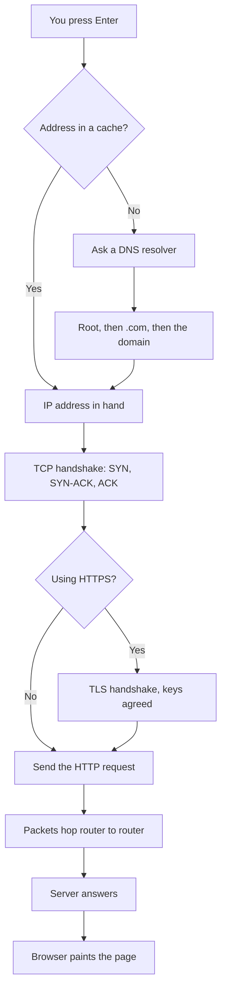

---
title: "인터넷은 어떻게 굴러가나 — 주인 없는 7만 5천 개 네트워크의 합의"
description: "인터넷은 누가 만든 하나의 시스템이 아니라 서로 믿지 않는 7만 5천 개 네트워크가 패킷을 주고받기로 한 약속이다. 패킷 교환, 캡슐화, BGP, 그리고 빛의 속도라는 한계까지 짚었다."
date: "2026-09-01"
published_at: "2026-09-05"
slug: "how-the-internet-actually-works"
category: "news"
tags: ["webdev","backend","devops","programming","beginners"]
cover: "https://media2.dev.to/dynamic/image/width=1000,height=420,fit=cover,gravity=auto,format=auto/https%3A%2F%2Fdev-to-uploads.s3.us-east-2.amazonaws.com%2Fuploads%2Farticles%2Ffxnd7iq7dc3kzby7m3qz.png"
coverAlt: "How the internet actually works, and why nobody is in charge of it"
source_id: "devto-4547118"
source_url: "https://dev.to/lovestaco/how-the-internet-actually-works-and-why-nobody-is-in-charge-of-it-3im8"
source_title: "How the internet actually works, and why nobody is in charge of it"
source_author: "Athreya aka Maneshwar"
source_published: "2026-09-01"
---

<LinkCard url="https://dev.to/lovestaco/how-the-internet-actually-works-and-why-nobody-is-in-charge-of-it-3im8" author="Athreya aka Maneshwar" date="2026-09-01" />

## 개요

영상을 누르면 1초쯤 뒤에 첫 프레임이 뜬다. 그 1초 사이에 당신의 요청은 열다섯 곳쯤 되는 회사들의 장비를 거쳤고, 어쩌면 바다를 한 번 건넜다가 돌아왔다. 그 과정을 조율한 주체는 아무도 없다.

Dev.to에 올라온 이 글은 "인터넷은 네트워크들의 글로벌 네트워크"라는 흔한 설명이 사실상 아무것도 알려주지 않는다고 지적하며, 실제로 무엇이 어떻게 맞물려 돌아가는지를 뜯어본다. 결론부터 말하면 인터넷은 누가 만든 물건이 아니라 약 7만 5천 개의 독립 네트워크가 "트래픽을 이렇게 넘기자"고 합의한 결과물이다.

## 인터넷은 하나가 아니다, 7만 5천 개다

먼저 잡고 갈 전제. **인터넷은 누군가 설계해서 지은 시스템이 아니다.**

당신의 ISP도 그중 하나, 대학교 전산망도 하나, Cloudflare도 하나다. 각자 자기 케이블과 라우터를 소유하고, 특별히 누구에게 보고하지 않으며, 자발적으로 서로를 연결한다. 이 관점을 잡고 나면 인터넷의 이상한 점들이 하나씩 설명되기 시작한다.

구조는 세 덩어리로 나뉜다.


**엣지(edge)** 는 뭔가 말하고 싶어 하는 모든 것이다. 휴대폰, 노트북, 랙에 꽂힌 서버, 요즘은 초인종까지. 이들을 호스트 또는 종단 시스템(end system)이라 부르고, 요청하는 클라이언트와 답하는 서버로 대충 갈린다.

**액세스 네트워크(access network)** 는 진입로다. 집의 광케이블이나 유선, 사무실 망, 주머니 속 5G. 첫 번째 라우터까지 데려다주는 게 유일한 임무다. 그리고 거의 언제나 전체 여정에서 가장 느린 구간이다. 다음번에 웹사이트가 느리다고 탓하기 전에 기억해 둘 만하다.

**코어(core)** 는 한가운데의 그물망이다. 라우터와 그 사이 링크뿐, 그 외엔 없다. 관제실도, 마스터 서버도, 소유한 회사도 없다.

## 당신을 위해 예약된 회선은 없다

설계가 영리해지는 지점이 여기다.

인터넷 이전에 두 지점을 연결한다는 건 **회선(circuit)** 을 잡는 일이었다. 전화를 걸면 통화가 끝날 때까지 물리적 경로 하나가 통째로 예약됐다. 말을 하든 숨만 쉬든 상관없이.

인터넷은 그 방식을 버렸다. 데이터는 **패킷** 으로 잘게 쪼개지고, 각 패킷에 출발지와 목적지가 찍힌 뒤, 네트워크에 던져져 각자 알아서 살아남는다.


3번 패킷은 프랑크푸르트를 거치고 4번 패킷은 암스테르담을 거칠 수 있다. 순서가 뒤바뀌어 도착하기도 하고, 아예 안 오는 것도 있다.

예약 회선보다 나빠 보이고, 대화 하나만 놓고 보면 실제로 좀 나쁘다. 대신 얻는 게 크다.

- **망을 효율적으로 나눠 쓴다.** 뭘 입력할지 고민하는 동안 차선 하나를 붙잡고 있는 사람이 없다.
- **손상을 우회한다.** 케이블이 끊기면 장애가 아니라 우회로가 된다. 애초에 그게 설계 목표였다.
- **말도 안 되게 확장된다.** 라우터는 당신의 대화를 추적하지 않는다. 패킷 하나를 보고 넘길 뿐이다.

재조립, 재전송, 순서 맞추기는 전부 양 끝단에서 일어난다. 가운데는 눈부시게 멍청한 상태로 남는다. 이 원칙에는 [end-to-end argument](https://web.mit.edu/Saltzer/www/publications/endtoend/endtoend.pdf)라는 이름이 붙어 있고, 인터넷이 이만큼 커질 수 있었던 이유로 꼽힌다.

## 계층마다 봉투를 하나씩 씌운다

그럼 바이트 덩어리 하나가 어떻게 길을 찾을까. 봉투에 네 번 담긴다.


브라우저가 **애플리케이션 계층** 에서 요청을 만든다. HTTP, 메일이면 SMTP, 이름 조회면 DNS.

**전송 계층** 이 포트 번호와 시퀀스 번호를 씌운다. 순서대로 확실히 가야 하면 TCP, 좀 잃더라도 빨라야 하면 UDP.

**네트워크 계층** 이 그 위에 IP 주소를 씌운다. 출발지와 목적지, 우편 주소와 같은 역할이다.

**링크 계층** 이 다시 그 위에 다음 홉의 하드웨어 주소를 씌운다. 보통 몇 미터 떨어진 집 안 공유기다.

반대편에서는 각 계층이 자기 봉투만 벗겨내고 나머지를 위로 올린다. 내려갈 때가 캡슐화, 올라올 때가 역캡슐화다.

이게 잡학 상식이 아니라 중요한 이유는 따로 있다. **각 계층은 바로 아래 계층만 안다.** 다운로드 중에 와이파이에서 유선으로 옮겨가도 맨 아래 봉투만 바뀐다. TCP는 눈치채지 못하고, 브라우저는 더더욱 모른다. 애플리케이션 코드를 한 줄도 건드리지 않고 물리 네트워크 기술 세대를 통째로 갈아치울 수 있다는 뜻이고, 세상이 광케이블로 넘어갈 때, 다시 5G로 넘어갈 때 정확히 그 일이 일어났다.

봉투는 직접 들여다볼 수도 있다.

```bash
# 나와 목적지 사이 모든 라우터를 한 줄씩
traceroute -q1 dev.to
```


```bash
# 요청 하나가 감싸이는 과정을 실시간으로
sudo tcpdump -n -i any -c 5 'host dev.to and port 443'
```


둘 중엔 `traceroute` 쪽이 더 재미있다. 각 줄은 실제 건물 안에 있는 실제 기계고, 실제 회사가 소유하고 있으며, 당신의 패킷을 넘겨주기로 동의한 곳이다.

## 포워딩과 라우팅은 다른 일이다

이 두 단어는 알 만한 사람들도 섞어 쓴다. 완전히 다른 작업이다.


**포워딩** 은 국소적이고 빠르다. 패킷이 라우터에 도착하면 목적지 주소를 보고, 포워딩 테이블에서 가장 길게 일치하는 프리픽스를 찾아, 해당 포트로 밀어낸다. 그게 전부다. 전용 하드웨어에서 나노초 단위로, 초당 수백만 번. 라우터는 나머지 여정을 모르고 신경도 쓰지 않는다.

**라우팅** 은 전역적이고 느리다. 그 테이블을 애초에 만들어내는 과정이고, 지구상의 모든 네트워크가 이웃에게 자기가 어디까지 닿을 수 있는지 끊임없이 알려주는 일이다.

하나는 지도를 읽는 일, 다른 하나는 지도에 뭘 그릴지 다투는 일이다.

## 그 다툼의 이름이 BGP다

네트워크들은 [BGP(Border Gateway Protocol)](https://datatracker.ietf.org/doc/html/rfc4271)로 자기 도달 범위를 알린다. ISP가 "이 주소들은 나를 통해 갈 수 있다"고 말하면 이웃들이 그 말을 옮기고, 몇 분 안에 지구 전체가 갱신된다.


여기서 조금 섬뜩한 대목이 나온다.

**BGP에는 그 광고가 사실인지 확인할 장치가 내장돼 있지 않다.**

네트워크 운영자들이 정직하고 유능하다는 가정 위에 세워진 프로토콜이다. 어떤 네트워크가 자기 소유가 아닌 주소 대역을 광고하고 이웃들이 그걸 믿으면, 해당 주소로 향하던 전 세계 트래픽이 엉뚱한 곳으로 흘러간다.

가정이 아니다. 2008년 파키스탄 텔레콤은 자국 내 YouTube 차단을 시도하다 실수로 YouTube 주소 대역을 상위 사업자에게 광고했고, [약 두 시간 동안 지구 대부분에서 YouTube를 인터넷 밖으로 밀어냈다](https://www.ripe.net/publications/news/youtube-hijacking-a-ripe-ncc-ris-case-study/). 2018년에는 비슷한 하이재킹으로 DNS 서비스 트래픽을 돌려 암호화폐를 훔친 사례도 있었다.

[RPKI](https://www.ripe.net/manage-ips-and-asns/resource-management/rpki/) 같은 시도가 암호학적 검증을 조금씩 붙이고 있어서, 네트워크가 자기가 광고하는 대역을 실제로 소유했음을 증명할 수 있게 됐다. 다만 도입은 아직 부분적이다. 내가 쓰는 ISP가 이걸 챙겼는지는 [isbgpsafeyet.com](https://isbgpsafeyet.com/)에서 확인할 수 있다.

의외로 놀라는 지점이 하나 더 있다. 라우팅은 **가장 빠른** 경로를 찾는 일이 아니다. BGP는 주로 사업 관계를 보고 경로를 고른다. 트래픽을 실어 나르는 데 돈이 들기 때문에, 네트워크는 돈을 내야 하는 경로보다 돈을 받는 경로를 선호한다. 당신의 패킷은 가장 짧은 길이 아니라, 누군가 합의해 준 가장 싼 길로 간다.


## 엔터를 누르면 실제로 벌어지는 일

지금까지의 얘기를 요청 하나에 모아 보자.



이 중 상당 부분이 준비 동작이라는 점이 눈에 띈다. 실제 페이지의 첫 바이트가 움직이기도 전에 이름 조회 한 번, 3-way 핸드셰이크 한 번, 보통 그 위에 TLS 협상까지 끝내야 한다.

일상적인 웹 브라우징에서 대역폭보다 지연 시간이 훨씬 아픈 이유가 여기 있다. 파이프가 굵어져도 왕복 시간이 줄지는 않고, 화면에 뭐라도 그려지기 전에 이미 여러 번의 왕복 값을 치른 뒤다. 서버가 멀리 있는 사이트라면 회선 속도를 올려봐야 거의 아무 효과가 없다.


## 뚫고 내려갈 수 없는 바닥

마지막으로 하나. 이걸 알면 여러 아키텍처 결정이 설명된다.

광섬유 속 빛은 진공에서의 광속의 약 3분의 2로 이동한다. 런던에서 뉴욕까지가 약 5,500km. 케이블이 완벽하게 직선으로 깔려 있다면 편도 28밀리초쯤인데, 실제로는 그렇지 않으니 35~40밀리초로 잡자.

HTTPS 요청 하나가 첫 바이트를 받아 오려면 왕복이 여러 번 필요하다. 뭔가 시작되기까지 150밀리초 정도가 걸리고, 돈을 아무리 부어도 이 숫자는 움직이지 않는다. 공학 문제가 아니라 물리 문제이기 때문이다.

CDN이 존재하는 이유가 통째로 여기서 나온다. 패킷을 더 빠르게 만들 수 없으니 콘텐츠를 더 가까이 옮기는 것이다. 지금까지 들어본 모든 "엣지 컴퓨팅" 홍보 문구는 근본적으로 광속에 대한 우회책이다.


## 그래서 인터넷이 뭐냐면

케이블은 아니다. 그건 그냥 유리다.

웹도 아니다. 웹은 그 위에 올라탄 애플리케이션 하나고, 그마저도 파티에 20년 늦게 도착했다.

인터넷은 합의다. 독립적으로 소유되고 서로를 딱히 믿지도 않는 수만 개의 네트워크가, 허가도 계약도 전화 한 통도 없이 서로에게 패킷을 건네게 해 주는 프로토콜 묶음.

가운데를 멍청하게 두고 가장자리가 똑똑해지도록 허용했기 때문에 돌아간다. 영상 통화를 상상조차 할 수 없었던 사람들이 1970년대에 내린 설계 결정이고, 그 결정은 지금까지 버텼다.

---

*이 글은 위 출처를 바탕으로 한국 독자를 위해 재작성한 기사입니다. 원문의 사실과 수치에 근거하며, 별도의 견해를 포함하지 않습니다.*
