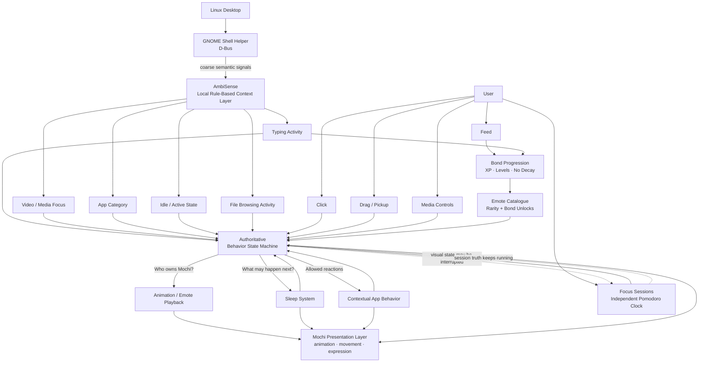

---
title: "OpenAI의 Codex Pet보다 나은 데스크톱 펫을 만들었다"
description: "OpenAI가 2026년 5월 내놓은 Codex Pets는 코딩 에이전트 상태를 알려주는 귀여운 오버레이다. 한 개발자가 같은 아이디어에서 출발해 상태 머신과 기억, 맥락 인식을 갖춘 리눅스 데스크톱 동반자 Mochi를 만들었다."
date: "2026-09-26"
published_at: "2026-09-27"
category: "news"
slug: "mochi-desktop-vs-codex-pets"
tags: []
cover: "https://media2.dev.to/dynamic/image/width=1000,height=420,fit=cover,gravity=auto,format=auto/https%3A%2F%2Fdev-to-uploads.s3.us-east-2.amazonaws.com%2Fuploads%2Farticles%2Fw6f927f50lncfh46mbfb.png"
coverAlt: "I Built a Better Codex Pet Than OpenAI Did"
source_id: "devto-4749245"
source_url: "https://dev.to/mikachu/i-built-a-better-codex-pet-than-openai-did-eib"
source_title: "I Built a Better Codex Pet Than OpenAI Did"
source_author: "Mika Flowers"
source_published: "2026-09-26"
---

<LinkCard url="https://dev.to/mikachu/i-built-a-better-codex-pet-than-openai-did-eib" author="Mika Flowers" date="2026-09-26" />

## 개요

OpenAI가 2026년 5월 Codex Pets를 출시했다. 코딩 에이전트에 얼굴을 붙이는 기능이다. 윈도우와 macOS 화면 위에 작은 캐릭터가 떠다니면서 Codex가 지금 뭘 하는지 실시간으로 보여주고, 작업이 끝나거나 사용자 입력이 필요하면 알려준다. 기본 펫 여덟 종과 함께, 사용자가 올린 이미지로 AI 애니메이션 펫을 만드는 기능까지 얹어서 나왔다.

개발자 Mika Flowers는 이 기능을 보고 다른 결론에 도달했다. 스프라이트를 걷어내고 나면 Codex Pet은 결국 꼬리 달린 상태등이라는 것이다. 사용자 입력을 기다릴 땐 빨간 시계, 끝나면 초록 체크. 그래서 직접 만들었다. [Mochi](https://github.com/miflow13/mochi-desktop), 진짜 상태 머신과 기억을 가진 오픈소스 리눅스 데스크톱 동반자다.

글쓴이는 시작부터 선을 긋는다. 공정한 비교가 아니라고. Codex Pets는 수백만 명이 쓰는 코딩 에이전트에 붙은 작은 기능이고, 첫날부터 두 운영체제를 지원할 인력을 가진 팀이 만들었다. Mochi는 1인 개발, 리눅스 전용, 알파 단계다. "더 다듬어지고 널리 쓰이는 제품"을 묻는다면 답은 Codex Pets다. 둘이 공유하는 건 딱 하나, 화면 위에 사는 작은 생물이라는 아이디어뿐이다. 이 글은 그 아이디어에서 출발하되 "귀여운 상태등"에서 멈추지 않으면 어떤 물건이 나오는지에 대한 기록이다.

## Codex Pets는 정확히 무엇인가

기능적으로 Codex Pet이 묶여 있는 대상은 하나다. Codex 에이전트 스레드의 상태. 픽셀아트로 그려진 캐릭터가 Codex가 코드를 쓰는 동안 바탕화면 위를 떠다니며 마우스 조작과 Codex 상태에 반응한다. 생각 중이면 머리를 긁고, 작업이 끝나면 말풍선을 띄운다. 커스텀 펫은 매니페스트 파일에 스프라이트시트를 더해 폴더에 넣으면 끝이다.

여기엔 "에이전트가 지금 뭘 하고 있나" 외의 내부 상태가 없다. 세션 사이를 넘나드는 기억도 없고, 결국 Codex의 상태를 비추는 것 외의 행동도 없다.

글쓴이는 이게 잘못됐다고 말하지 않는다. 오히려 그 일에 딱 맞는 양의 엔지니어링이라고 인정한다. 흘깃 보고 파악하는 에이전트 상태 위젯에 상태 머신은 필요 없다. 귀엽고, 한눈에 읽히고, 커뮤니티가 쉽게 고쳐 쓸 수 있으면 된다. OpenAI는 그 요구사항을 정확히 맞췄다. 다만 그건 어디까지나 좁은 요구사항이고, 펫은 자기가 지켜보던 스레드보다 오래 살지 못한다.

## Mochi는 다른 물건이다

Mochi는 외부의 무언가를 보고하지 않는다. 다른 도구의 상태등이 아니라, 어떤 앱을 켜뒀든 상관없이 바탕화면에 그냥 살고 있는 존재로 느껴지는 게 목표다. 훨씬 어려운 문제이고, 그 차이가 구조에 드러난다.

내부적으로 Mochi는 단일 권위를 가진 행동 상태 머신 위에서 돈다. 클릭, 드래그, 수면, 타이핑 감지, 미디어 재생, 실행 중인 앱 인식까지 수십 개 시스템이 서로 경쟁하는데, 이들이 매 순간 한 가지 질문에 합의해야 한다. 지금 Mochi를 소유한 게 누구고, 다음에 무엇이 허용되는가.

### Codex Pet에 대응물이 없는 시스템들

여기까지는 시작일 뿐이다. Mochi에는 Codex Pet 쪽에 아예 대응하는 개념이 없는 시스템이 여럿 붙어 있다.

- **AmbiSense** — 로컬에서 규칙 기반으로 동작하는 주변 인식 계층. 타이핑, 영상 재생, 파일 탐색, 활성 앱 같은 데스크톱 활동을 프라이버시에 안전한 의미 신호로 압축한다. LLM도 아니고 클라우드 서비스도 아니며, 실제 키 입력이나 파일명, 창 제목은 애초에 보지 못하도록 만들었다.
- **유대 성장** — 느리고, 의도적으로 벌을 주지 않는 관계 시스템. 연속 기록도 없고 감소도 없으며 하루 빼먹었다고 불이익도 없다. 타이핑 시간과 먹이 주기로 XP가 쌓이고, 레벨이 오르면 별도의 연출이 나온다.
- **집중 세션** — 뽀모도로 방식의 도메인 모델. 자체 시계를 갖고 있어서 드래그나 클릭으로 화면이 끊겨도 계속 돈다. Mochi가 어떻게 보이는가와 실제로 무엇이 참인가를 일부러 분리한 설계다.
- **감정표현 카탈로그** — 유대 단계로 잠금이 풀리고 희귀도 등급이 있다. 오래 데리고 있을수록 Mochi가 할 수 있는 일이 실제로 늘어난다.
- **GNOME Shell 헬퍼** — D-Bus로 실제 데스크톱 맥락을 읽는다. 타이핑 신호, 유휴/활성 상태, 앱 분류, 영상 포커스. 여기서도 원시 데이터가 아니라 성긴 의미 신호로 줄여서 넘긴다.

> Mochi의 구조는 무엇이 참인지와 무엇이 지금 보이는지를 분리한다. 데스크톱 맥락, 사용자 조작, 성장, 집중 상태, 자율 행동이 모두 하나의 행동 상태 머신으로 모여들고, 그 상태 머신이 지금 누가 Mochi를 "소유"하는지, 어떤 전이가 합법인지 결정한다.

### 진짜 어려운 부분은 생애주기다

이 구조는 장식이 아니다. Mochi 코드베이스 문서의 상당 부분이 생애주기와 소유권 이야기다. 기능이 중단된 뒤에 낡은 애니메이션 콜백이 뒤늦게 실행되지 않도록 막는 일, 컨텍스트 메뉴가 화면에서 사라졌는데 보이지 않는 입력 그랩이 남아 있지 않도록 하는 일, 복구 시점에 중단 직전 상황을 그대로 재생하는 대신 지금 살아 있는 맥락을 다시 평가하도록 만드는 일.

부품이 충분히 많아져서 시스템이 스스로와 충돌하기 시작할 때만 만나는 종류의 문제다. 그리고 Codex Pet은 애초에 그런 문제를 만날 만큼 크지 않다.

## 결국 무엇이 다른가

글쓴이는 자랑으로 끝내지 않고 솔직한 정리를 붙인다. Codex Pet은 얇아야 맞다. 코딩 에이전트에 붙인 기능이고, 몇 분이면 만들고 한눈에 이해되도록 설계됐다. 여기에 Mochi 수준의 구조를 넣는 건 과잉이다.

그런데 바로 그게 요점이다. OpenAI는 자기 제품의 마스코트를 만들었고, Mika Flowers는 마스코트 자체가 존재 이유인 제품을 만들었다. 지속성, 맥락 인식, 특정 앱에 기대지 않는 돌봄 메커니즘, 그리고 이리저리 끌려다니고 중간에 끊기고 일주일간 방치돼도 버티는 상태 머신을 갖춘 물건이다. Codex Pets는 수십억 달러짜리 코딩 에이전트 등에 올라탄 괜찮은 기능이고, Mochi는 그 아이디어에 끝까지 간 결과물이다.

글쓴이는 마지막 문장으로 정리한다. 둘 중 어느 쪽을 유지보수하고 싶은지는 자기가 안다고.

Mochi는 오픈소스다. [코드를 보거나 이슈를 남기거나 그냥 인사하러 가볼 수 있다](https://github.com/miflow13/mochi-desktop). 원문에 따르면 글에 담긴 Codex Pets 내용은 공개된 보도와 문서에서 가져온 것으로, 내부 정보는 아니다.

---

*이 글은 위 출처를 바탕으로 한국 독자를 위해 재작성한 기사입니다. 원문의 사실과 수치에 근거하며, 별도의 견해를 포함하지 않습니다.*
