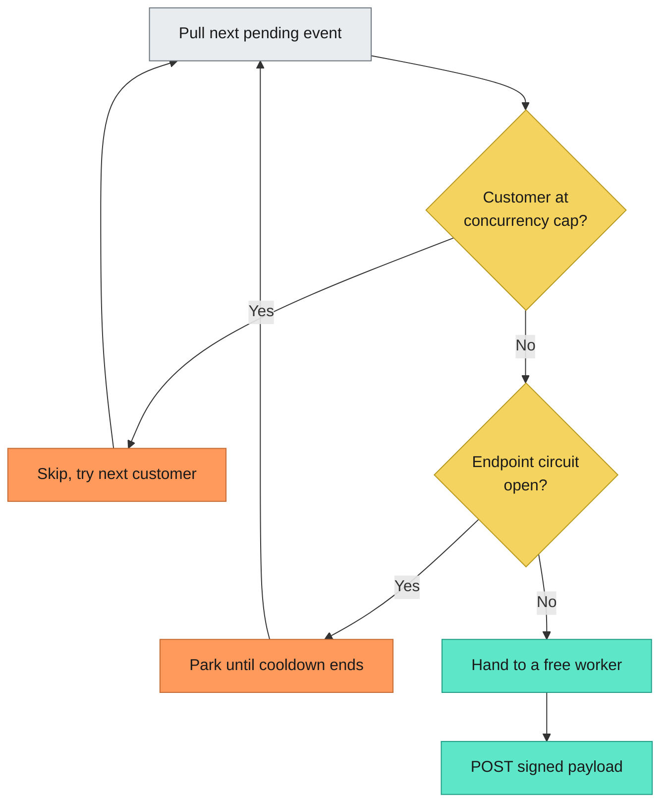
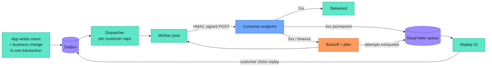

---
title: "하루 1000만 건 웹훅, POST 한 줄로는 안 된다"
description: "웹훅은 POST 요청 하나면 끝날 것 같지만, 하루 1000만 건을 흘려보내려면 아웃박스·디스패처·재시도 분류·DLQ가 필요하다. 순진한 구현을 단계별로 깨뜨려가며 실제 서비스가 버티는 구조를 만들어본다."
date: "2026-09-02"
published_at: "2026-09-06"
category: "news"
tags: ["backend","webdev","devops","programming","tech"]
cover: "https://media2.dev.to/dynamic/image/width=1000,height=420,fit=cover,gravity=auto,format=auto/https%3A%2F%2Fdev-to-uploads.s3.us-east-2.amazonaws.com%2Fuploads%2Farticles%2Fgv9d7lu0z0vroyefcstv.png"
coverAlt: "Designing a Webhook Delivery System for 10 Million Events a Day"
slug: "webhook-delivery-system-10m-events"
source_id: "devto-4556226"
source_url: "https://dev.to/lovestaco/designing-a-webhook-delivery-system-for-10-million-events-a-day-2p5d"
source_title: "Designing a Webhook Delivery System for 10 Million Events a Day"
source_author: "Athreya aka Maneshwar"
source_published: "2026-09-02"
---

<LinkCard url="https://dev.to/lovestaco/designing-a-webhook-delivery-system-for-10-million-events-a-day-2p5d" author="Athreya aka Maneshwar" date="2026-09-02" />

## 개요

기획 회의에서 웹훅 얘기가 나오면 누군가는 이렇게 말한다. "웹훅요? 그거 POST 한 방이잖아요. 반나절이면 되죠."

POST 한 방이라는 말 자체는 틀리지 않았다. 우리 쪽에서 무슨 일이 일어났고, 고객이 그걸 알고 싶어 하니, HTTP 요청을 하나 보낸다. 그게 전부다.

문제는 6주 뒤다. 고객사 서버가 멈춰 있던 몇 시간 동안 결제 이벤트 4000건을 놓쳤다는 전화를 받는다. LiveReview를 만들고 있는 개발자 Athreya(Maneshwar)가 Dev.to에 올린 글은 이 지점을 파고든다. 하루 1000만 건, 평균 초당 115건에 피크는 그보다 훨씬 높은 트래픽을 가정하고, 가장 순진한 구현부터 시작해 일부러 하나씩 깨뜨려가며 실제 고객을 만나도 버티는 구조까지 밀고 나간다.

## 버전 1: 그냥 POST 한다

요청 핸들러 안에서 이벤트가 발생하면 고객 URL로 곧장 POST하고 `200 OK`를 기다린다.

```python
def on_payment_succeeded(payment):
    db.save(payment)
    requests.post(customer.webhook_url, json=payment.to_dict())  # 🙃
    return {"ok": True}
```

스테이징에서는 잘 돈다. 거기서 "고객"은 옆 탭에 띄워둔 webhook.site니까.

프로덕션은 다르다. 고객 엔드포인트가 크론 잡까지 같이 돌리는 작은 박스의 Rails 앱이라고 해보자. 오후 3시에 크론이 돌기 시작하면 응답에 8초가 걸린다. 그러면 **우리 쪽** 요청 핸들러가 남의 인프라를 기다리며 스레드 하나를 붙잡고 앉아 있게 된다. 레이턴시 그래프가 튀고 커넥션 풀이 마른다. 이 고객과 아무 상관 없는 우리 사용자들이 타임아웃을 보기 시작한다.

최악은 그다음이다. 요청이 타임아웃 나고 프로세스는 다음으로 넘어가는데, 이벤트는 사라진다. 어디에도 적어두지 않았기 때문이다. 이미 리턴해버린 함수의 지역 변수로만 존재했던 것이다.


여기서 버그는 "느렸다"가 아니다. 우리 서비스의 가용성을 고객 서버의 가용성에 종속시켰고, 그것도 핫 패스에서 그랬다는 게 버그다.


## 버전 2: 일단 적어두고 시작한다

분산 시스템 제1원칙. 뭘 하기 전에 먼저 적어둔다.

핸들러는 이제 POST를 하지 않는다. 이벤트를 테이블에 쓰고 — 그 이벤트를 유발한 비즈니스 변경과 **같은 트랜잭션 안에서** — 바로 리턴한다. [트랜잭셔널 아웃박스 패턴](https://microservices.io/patterns/data/transactional-outbox.html)이다.

여기엔 짚고 넘어갈 만한 미묘한 지점이 있다. 결제를 저장한 다음 큐에 밀어 넣으면 시스템이 둘이고, 그 사이에 틈이 생긴다. 틈에서 크래시가 나면 이벤트 없는 결제가 남는다. 이벤트 행을 결제와 **같은** DB 트랜잭션에 넣으면 둘 다 되거나 둘 다 안 된다. 틈이 없어진다.

```sql
BEGIN;
  INSERT INTO payments (id, amount, status) VALUES (...);
  INSERT INTO webhook_outbox (customer_id, event_type, payload, status)
       VALUES (..., 'payment.succeeded', ..., 'pending');
COMMIT;
```

별도 워커가 `pending` 행을 폴링해서 실제 전송을 담당한다. 핸들러는 다시 빨라졌고 이벤트는 durable해졌다. 전송이 실패해도 죽은 스택 프레임 안이 아니라 우리가 볼 수 있고 재시도할 수 있는 곳에서 실패한다.

그런데 문제를 하나 더 교묘한 것으로 바꿔놨을 뿐이다.

워커 풀 하나가 큐 하나에서 순서대로 당겨 간다. 고객 A의 엔드포인트가 타임아웃 나는 데 10초 걸린다면, A의 작업을 집은 워커는 전부 10초씩 묶인다. 그동안 B부터 Z까지의 이벤트는 얌전히 뒤에 쌓인 채 아무 데도 못 간다.

헤드 오브 라인 블로킹(head-of-line blocking)이다. 큐 옷을 입은 시끄러운 이웃 문제다. 엔드포인트 하나가 망가지면 전체가 같이 느려진다. 가장 나쁜 고객이 나머지 전부의 속도를 정한다.


## 버전 3: 고객마다 차선을 하나씩 준다

해법은 공정성이고, 공정성에는 그걸 강제할 주체가 필요하다.

워커 풀 앞에 디스패처를 세운다. 디스패처가 하는 일은 **다음에 어떤 이벤트를 보낼지** 정하는 것 하나뿐이고, 무조건 가장 오래된 걸 집으면 안 된다.

디스패처는 고객별로 지금 몇 개의 워커가 붙어 있는지 센다. 고객 A는 이미 3개가 돌고 있고 상한이 3이다? 건너뛴다. 다음 고객 이벤트를 집는다. A는 나중에 다시 본다.

테넌트별 동시성 제한(per-tenant concurrency limiting)이다. 글쓴이는 이 설계 전체에서 투자 대비 효과가 가장 큰 한 가지로 이걸 꼽는다. [Stripe도](https://stripe.com/blog/rate-limiters) 동시성 제한을 일급 레이트 리미팅 수단으로 쓴다. 요청 수를 세는 데 그치지 않고 피해 범위 자체를 묶어버리기 때문이다.

효과는 이렇다. 고객 A의 재난은 이제 상한선 안에 갇힌다. 워커 3개는 A에 묶여 있지만 나머지 워커는 다른 고객들을 아무 문제 없이 처리한다. 느린 고객이 자기 자신만 느려지게 만든다. 고통이 있어야 할 자리에 정확히 놓인 셈이다.

여기서 더 나가고 싶다면 디스패처에 가중치 공정성을 넣는다. 시간당 백만 건씩 뿜어내는 무료 티어 고객 때문에 엔터프라이즈 고객이 굶는 일을 막을 수 있다.

시스템의 심장에 해당하는 라우팅 로직은 이렇다.



동시성 상한이 자리를 잡으면 그 옆의 서킷 브레이커 분기도 붙일 만하다. 어떤 고객의 엔드포인트가 최근 20번 연속 실패했다면 21번째도 실패한다는 걸 이미 안다. 그걸 확인하려고 워커를 쓸 이유가 없다.


## 버전 4: 웹훅 하나를 제대로 보내기

이번엔 끝까지 확대해보자. 워커가 작업 하나를 집었다. 무슨 일이 벌어지나?

타임아웃은 짧게. 60초가 아니라 10초다. 느린 엔드포인트는 고장 난 엔드포인트고, 그걸 확인하겠다고 워커를 붙잡아둘 이유가 없다.

그리고 돌아온 응답을 본다. 여기서 중요한 건 **실패가 다 같은 실패가 아니라는 점**이다.

- `200`, `201`, `204`: 전달 완료. 표시하고 넘어간다.
- Connection refused, 타임아웃, `502`, `503`, `429`: 일시적 실패. 상대 서버가 잠깐 힘든 상태다. 지수 백오프에 지터를 섞어 재시도한다. 지터가 없으면 상대 서버가 복귀하는 순간 밀린 재시도가 전부 같은 밀리초에 꽂힌다. AWS가 쓴 [지터에 관한 정본 문서](https://aws.amazon.com/builders-library/timeouts-retries-and-backoff-with-jitter/)는 10분 투자할 가치가 있다.
- `404`, `410`, DNS 미해소, TLS 핸드셰이크 실패: 영구적 실패. URL이 틀렸거나 엔드포인트가 사라졌다. 이걸 24시간 동안 12번 재시도하는 건 복원력이 아니라 그냥 허공에 트래픽을 쏘면서 고객이 설정 오류를 알아차릴 시점을 늦추는 짓이다. **빠르고 시끄럽게 실패시켜야 한다.**

세 번째 분류를 건너뛰는 팀이 많고, 재시도 큐를 쓰레기 매립지로 만드는 것도 바로 이 항목이다.

여기까지 왔으니 선택 사항이 아닌 두 가지를 짚는다.

**페이로드에 서명한다.** 모든 이벤트는 바디와 타임스탬프의 HMAC을 헤더에 담아 나간다. 고객은 공유 시크릿으로 다시 계산해서 진짜 우리가 보낸 이벤트인지 확인한다. 이게 없으면 웹훅 엔드포인트는 URL을 추측한 사람 누구나 가짜 "결제 성공" 이벤트를 쏠 수 있는 구멍이다. 타임스탬프는 서명 대상 **안에** 넣어야 한다. 그래야 가로챈 요청을 다음 주에 재생하지 못한다.

**두 번 처리될 거라고 가정한다.** 재시도는 곧 at-least-once 전달이다. 이건 엔지니어링으로 없앨 수 있는 결함이 아니라 문제의 형태 그 자체다. 요청이 타임아웃 나면 상대가 처리했는지 안 했는지 애초에 알 방법이 없다. 그러니 모든 이벤트에 안정적인 `id`를 부여하고, 고객에게 그 값을 키로 쓰라고 안내하고, 문서에 명확히 적는다. 정확히 한 번(exactly-once) 전달은 마케팅이다. at-least-once + 멱등성이 엔지니어링이다.


## 버전 5: 데드레터 큐는 제품 기능이다

재시도도 언젠가 바닥난다. 상대 엔드포인트가 8시간 재시도 창 내내 죽어 있었다면 더 해볼 게 없다.

그래도 이벤트를 지우지는 않는다. 데드레터 큐(DLQ)로 보낸다.

글쓴이가 가장 강조하는 대목이 여기다. 대부분의 구현이 딱 한 걸음 앞에서 멈춘다. **아무도 볼 수 없는 데드레터 큐는 그냥 데이터를 조금 천천히 잃는 방법일 뿐이다.**

UI를 붙인다. 고객이 자기 실패 전송 내역을 직접 볼 수 있는 대시보드를 제품 안에 만든다. 이벤트 타입, 타임스탬프, 시도 횟수, 그리고 상대 서버에서 실제로 받은 응답 바디까지. 마지막 항목이 지원 티켓을 정말 많이 줄여준다. "3시 4분에 당신 서버에서 `502 Bad Gateway`를 받았습니다"라는 한 줄이, 안 그랬으면 나흘간 이어졌을 "웹훅이 고장 났다"는 공방을 끝낸다.

그리고 리플레이 버튼을 준다. 배포를 고친 고객이 버튼을 누르면 이벤트가 `pending` 상태로 아웃박스에 돌아가 똑같은 파이프라인을 다시 탄다. 시간 범위 단위 벌크 리플레이까지 지원하면 장애 구간 전체를 클릭 한 번으로 복구할 수 있다.

가장 괴로운 지원 대화를 셀프서비스 동작으로 바꾼 셈이다. 꽤 좋은 거래다.


## 전체 그림



한 문장으로 읽으면 이렇다. 보내기 전에 적어두고, 다음에 누구를 보낼지 공정하게 정하고, 짧은 타임아웃으로 서명해서 보내고, 재시도할 가치가 있는 실패만 재시도하고, 그렇지 않은 실패는 실제로 고칠 수 있는 사람 눈에 보이게 만든다.


## 나중에 발목 잡는 것들

버전 구분에는 안 들어가지만 반드시 마주치게 되는 항목들이다.

**순서 보장.** 누군가는 요구한다. 고객별 순서 보장은 그 고객의 동시성을 1로 두겠다는 뜻이고, 응답 하나가 느려지면 그 고객의 스트림 전체가 멈춘다는 뜻이다. 공짜 기능이 아니라 실제 트레이드오프다. 보통은 시퀀스 번호를 보내서 상대가 정렬하게 하거나, 상태 자체 대신 "뭔가 바뀌었으니 가져가라"는 핑을 보내는 쪽이 낫다.

**페이로드 크기.** 4MB짜리 객체를 웹훅에 담지 않는다. id와 이벤트 타입만 보내고 나머지는 상대가 API를 호출해 가져가게 한다. 얇은 페이로드는 아웃박스에 저장하기도, 재시도하기도 싸다. 이벤트 발생 시점과 상대가 읽는 시점 사이에 상태가 바뀌면 어쩌나 하는 곤란한 질문도 피해 간다.

**SSRF.** 고객이 URL을 건네고 우리 서버가 그걸 호출한다. 교과서적인 서버 사이드 요청 위조 상황이다. 호스트명을 resolve하고, 사설 대역과 링크 로컬 주소를 거부하고, 리다이렉트 시 다시 검사해야 한다. `http://customer.com/hook`이 `169.254.169.254`로 리다이렉트되는 건 누군가 클라우드 메타데이터 자격증명을 읽으려는 시도다. [OWASP에 전체 목록이 있다](https://cheatsheetseries.owasp.org/cheatsheets/Server_Side_Request_Forgery_Prevention_Cheat_Sheet.html).

**포이즌 이벤트.** 역직렬화에서 워커를 죽이는 이벤트 하나는 영원히 재시도되면서 매번 워커를 하나씩 데려간다. 상대 쪽 실패뿐 아니라 **우리 쪽** 실패에도 시도 횟수 상한을 걸어야 한다.


## 그래서, 반나절?

POST 요청은 반나절 맞다. 진짜로.

나머지 95%가 문제다. 이벤트를 살려두는 아웃박스, 고객 하나가 모두의 오후를 망치지 못하게 막는 디스패처, "다시 해보자"와 "이건 영원히 안 된다"를 구분하는 재시도 분류기, 데이터 유실 사고를 버튼 하나로 바꾸는 리플레이 UI.

이 중에 특별한 건 하나도 없다. 테이블 하나, 디스패처 루프 하나, 그리고 실패 모드에 대한 약간의 규율이다. 하지만 고객이 신뢰하는 웹훅 시스템과, 고객이 방어적 폴링 코드를 따로 짜게 만드는 웹훅 시스템을 가르는 차이가 여기서 나온다. 이벤트를 한 번 놓쳤는데 그게 어디로 갔는지 우리가 답하지 못하는 순간, 고객은 반드시 폴링 코드를 짠다.

먼저 적어둔다. 나머지는 거기서 따라온다.

글쓴이는 마지막으로 독자에게 묻는다. 지금 어느 버전에 발이 묶여 있느냐고. 본인 추측으로는 버전 2일 거고, 큐를 막고 있는 그 고객 이름을 아마 외우고 있을 거라고.

---

*이 글은 위 출처를 바탕으로 한국 독자를 위해 재작성한 기사입니다. 원문의 사실과 수치에 근거하며, 별도의 견해를 포함하지 않습니다.*
